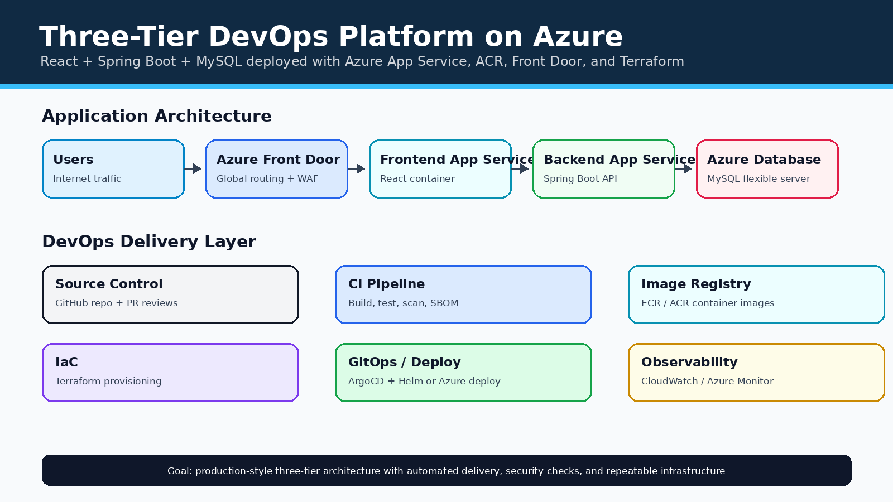
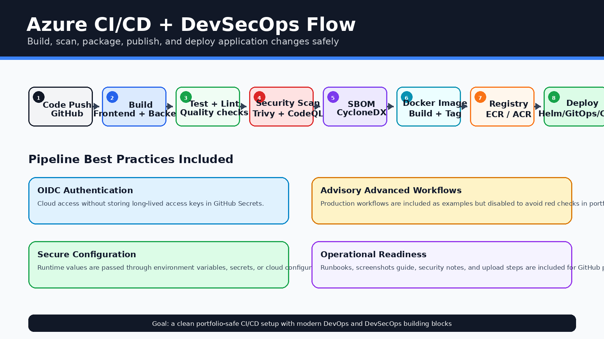
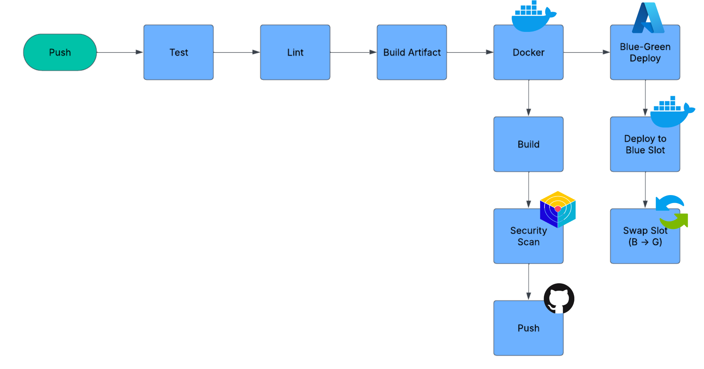
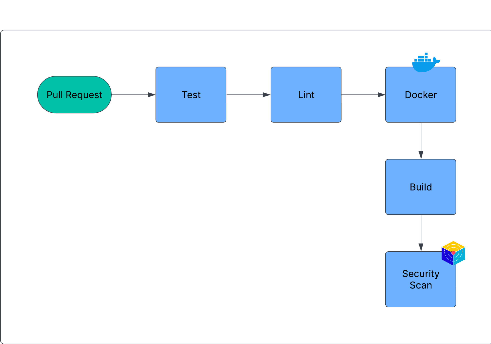
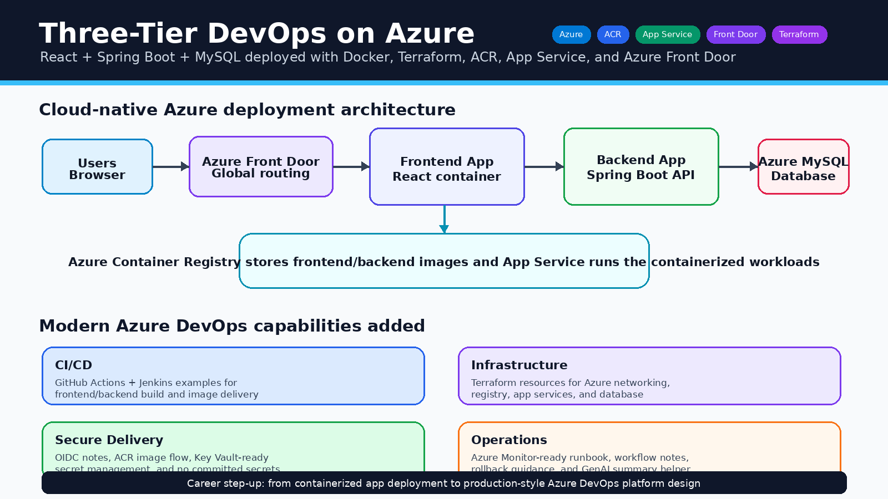
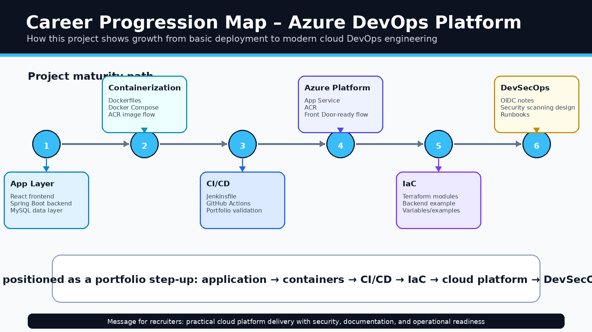

# Three-Tier DevOps Platform on Azure

A production-style DevOps project for deploying a **React frontend**, **Spring Boot backend**, and **MySQL database** using **Docker**, **Terraform**, **Azure App Service**, **Azure Container Registry**, **Azure Front Door**, and secure CI/CD practices.

This project keeps the original three-tier application recipe and upgrades the DevOps layer with modern portfolio-ready practices such as OIDC-based cloud authentication notes, security scanning, SBOM workflow design, runbooks, and safe GitHub Actions validation.

## Architecture

Generated project visual assets and any existing snapshots are included below to make the repository clear and professional for GitHub visitors.



### Existing infrastructure snapshot


## CI/CD and DevSecOps Flow



### Existing push pipeline snapshot



### Existing pull request pipeline snapshot




## Portfolio visuals and career progression

These visuals were added so the project looks complete even when live cloud screenshots are not available. They explain the architecture, DevOps workflow, and how this project represents a step forward in cloud/platform engineering.





## What this project demonstrates

- React frontend containerization
- Spring Boot backend containerization
- MySQL database integration
- Docker Compose local development
- Terraform-based Azure infrastructure
- Azure App Service container deployment model
- Azure Container Registry image flow
- Azure Front Door style global entry point
- GitHub Actions portfolio validation
- Jenkins pipeline example
- Optional Trivy, CodeQL, Checkov, and SBOM workflow design
- AI-ready release summary script

## Project structure

```text
.
├── src/                    # Frontend, backend, database samples, Docker Compose
├── infra/                  # Terraform modules for Azure infrastructure
├── .github/                # Safe portfolio validation workflow
├── docs/                   # Runbook, workflow, GenAI, screenshot notes
├── scripts/                # AI-ready release summary helper
├── Jenkinsfile             # Jenkins CI/CD pipeline example
└── README.md
```

## Local development

```bash
cd src
docker compose up --build
```

Frontend: `http://localhost:4200`

## Azure deployment flow

1. Build frontend and backend Docker images.
2. Push images to Azure Container Registry.
3. Provision infrastructure using Terraform.
4. Deploy containers to Azure App Service.
5. Route public traffic through Azure Front Door or the configured app endpoint.

## Jenkins pipeline

A Jenkinsfile is included to show a real CI/CD flow:

```text
Checkout → Frontend Build → Backend Build → Docker Build → Trivy Scan → Push to ACR → Terraform Validate
```

The cloud deployment steps are intentionally portfolio-safe until Azure credentials, ACR name, and environment configuration are added.

## GitHub Actions note

Only a safe **Portfolio Validation** workflow runs automatically. Advanced workflows from the original project are preserved in `.github/workflows-disabled/` and can be enabled later after configuring Azure OIDC credentials, ACR, Terraform backend, and environment variables.

## Security practices

- No `.env`, `.pem`, `.tfstate`, or cloud secrets committed
- Terraform state backend example included but not active by default
- Runtime values use environment variables and Azure configuration
- OIDC-based Azure authentication documented for future deployment
- Security scanning and SBOM workflows kept as enable-later examples

## Future improvements

- Enable Azure OIDC deployment workflow
- Add Azure Monitor dashboards and alerts
- Add blue/green deployment approval gates
- Add Key Vault integration for runtime secrets
- Add full Trivy/Checkov/CodeQL workflow after secrets are configured

## Known issues

See [KNOWN_ISSUES.md](KNOWN_ISSUES.md).


---

<p align="center">
  
</p>

<h2 align="center">🤝 Connect With Me</h2>

<p align="center">
  <em>
    Thanks for visiting this project! I’m continuously building hands-on DevOps, Cloud, Automation, and AI-enabled engineering projects to improve real-world deployment, monitoring, and infrastructure skills.
  </em>
</p>

<p align="center">
  
</p>

<p align="center">
  <a href="https://github.com/yugandhar99" target="_blank" rel="noopener noreferrer">
    
  </a>
  <a href="https://www.linkedin.com/in/yugandhar-devops" target="_blank" rel="noopener noreferrer">
    
  </a>
  <a href="https://yugandhar-portfolio-psi.vercel.app/" target="_blank" rel="noopener noreferrer">
    
  </a>
  <a href="mailto:yugandharethamukkala1999@gmail.com">
    
  </a>
</p>

<p align="center">
  
  
  
  
</p>

---

<p align="center">
  ⭐ If this project added value, feel free to star the repository and connect with me!
</p>

<p align="center">
  <strong>Built with ❤️ using modern DevOps practices</strong>
</p>

